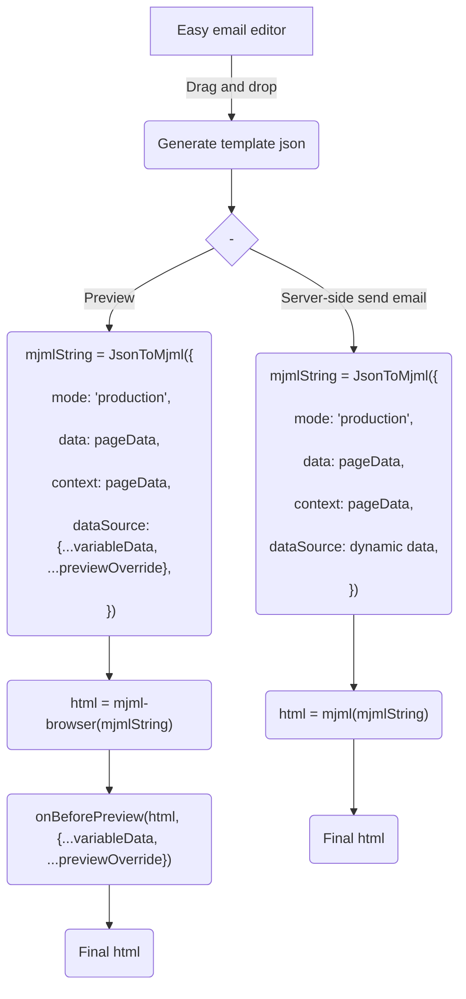

```mermaid

graph TB
    A[Easy email editor ] -->|Drag and drop | B(Generate template json)
    B --> Condition{"-"}

   Condition--> |Preview| C("
   mjmlString = JsonToMjml({
    <br/> mode: 'production',
    <br/>data: pageData,
    <br/> context: pageData,
    <br/>  dataSource: {...variableData, ...previewOverride},
    <br/> })
    ")
    C-->D("html = mjml-browser(mjmlString)")
    D-->E("onBeforePreview(html, {...variableData, ...previewOverride})")
    E-->F("Final html")

    Condition-->|Server-side send email|G("
   mjmlString = JsonToMjml({
    <br/> mode: 'production',
    <br/>data: pageData,
    <br/> context: pageData,
    <br/>  dataSource: dynamic data,
    <br/> })
    ")
    G-->H("html = mjml(mjmlString)")
    H-->I("Final html")


```
